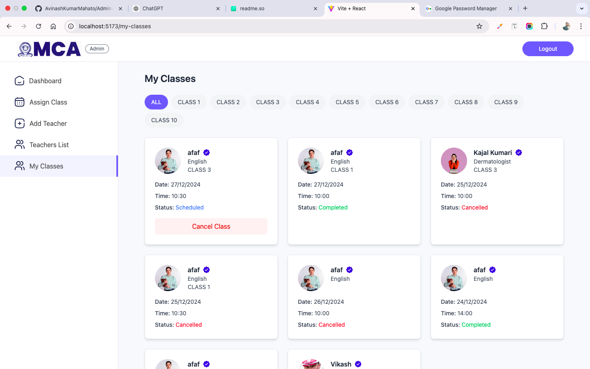
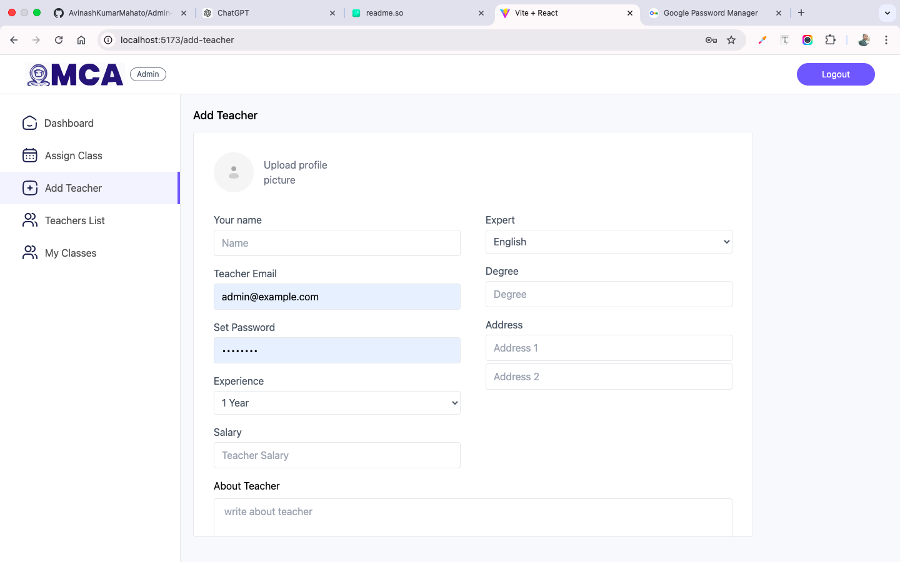
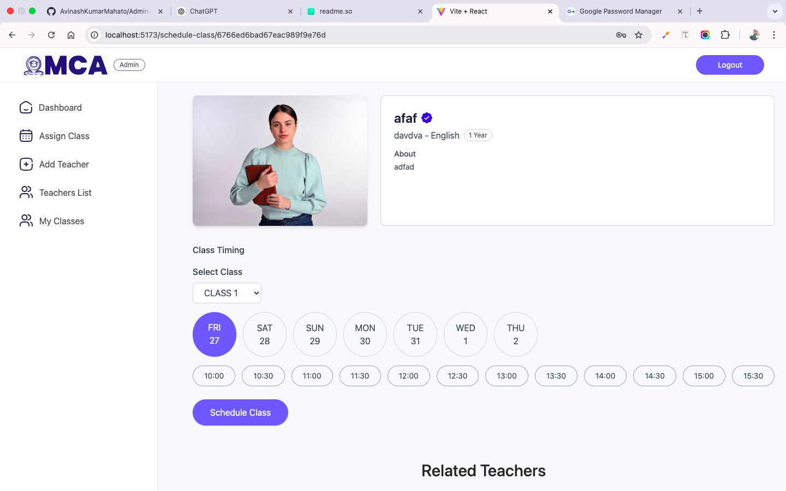
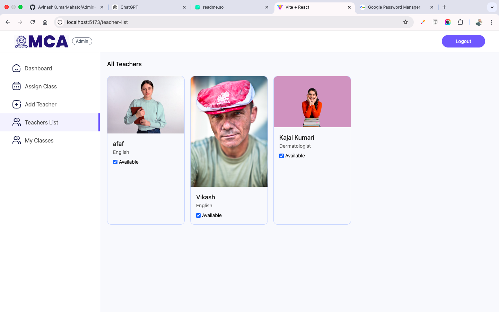
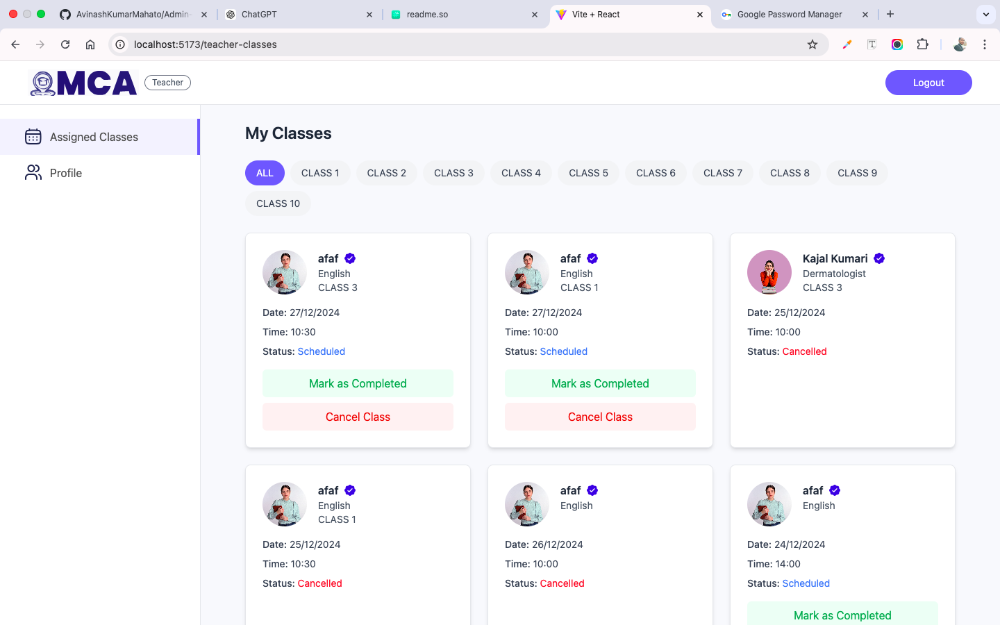
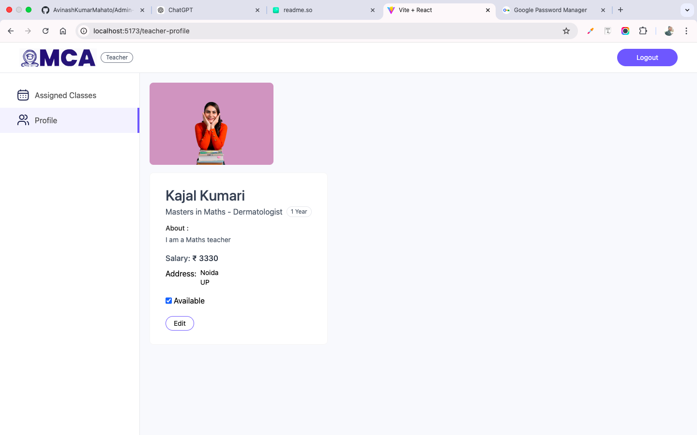
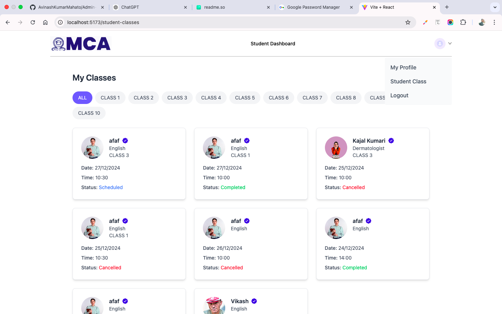
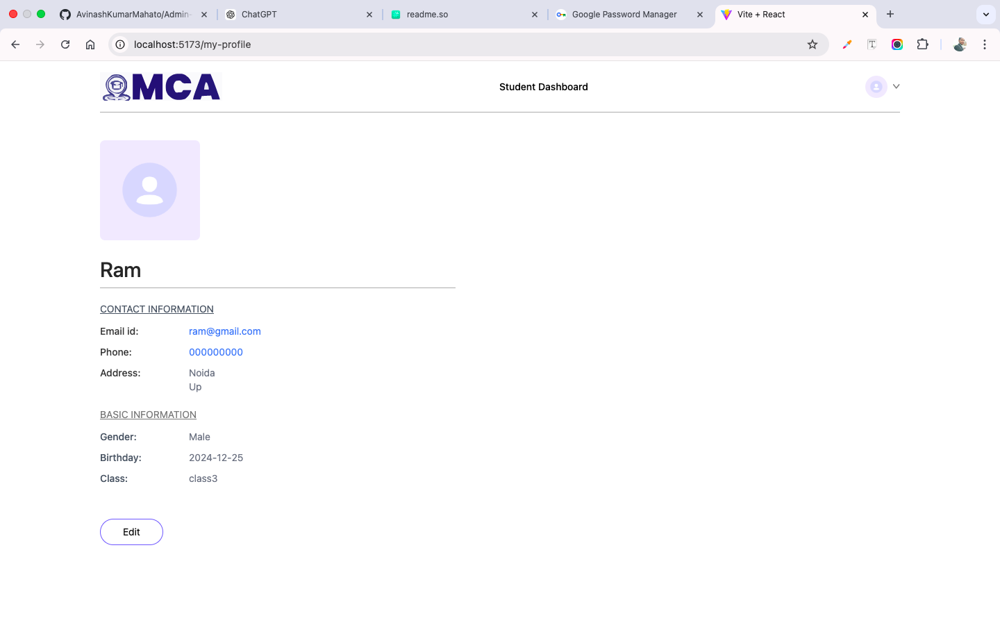

# School Management System

## Overview
The School Management System is a web-based application built using the MERN stack (MongoDB, Express.js, React.js, Node.js). It provides three types of logins: Admin, Teacher, and Student, each with distinct roles and functionalities to streamline the management and operation of school activities.

---

## Features

### Admin Role
- **Add Teachers**: Admin can add new teachers to the system.
- **Manage Teachers**: View the list of teachers and mark them as available or unavailable for classes.
- **Class Management**: Assign classes to teachers and cancel scheduled classes if needed.

### Teacher Role
- **Class Management**: View assigned classes, mark classes as completed, and cancel classes if necessary.
- **Profile Management**: Update personal profile details.

### Student Role
- **Class Information**: Access information about class schedules, including date, time, and cancellation status.
- **Profile Management**: Update personal profile details.

---

## Screenshots
Include screenshots of the following:
1. Admin Dashboard
2. Teacher Dashboard
3. Student Dashboard

### Admin Panel





### Teacher Panel



### Student Panel



---

## User Credentials

### Admin
- **Username**: admin@example.com
- **Password**: admin123

### Teacher
- **Username**: kajal@gmail.com
- **Password**: Kajal@123

### Student
- **Username**: ram@gmail.com
- **Password**: Ram@4458

---

## Live Demo
Access the live application at:  
[Admin Panel and Teacher Panel Live Link](https://admin-panel-school-management-system.vercel.app/)  
[Student Panel Live Link](https://student-panel-school-management-system.vercel.app/)

---

## Tech Stack
The application is built using the following technologies:
- **MongoDB**: Database for storing all application data.
- **Express.js**: Backend framework to handle server-side logic and API routes.
- **React.js**: Frontend library for building the user interface.
- **Node.js**: JavaScript runtime for running the server-side application.

---

## Installation and Setup

1. Clone the repository:
   ```bash
   git clone https://github.com/your-repo/school-management-system.git
   ```

2. Navigate to the project directory:
   ```bash
   cd school-management-system
   ```

3. Install dependencies for both frontend and backend:
   ```bash
   # Install frontend dependencies
   cd frontend && npm install

   # Install backend dependencies
   cd ../backend && npm install
   ```

4. Configure environment variables in the `backend` folder:
   - Create a `.env` file and add the following:
     - **MongoDB URI**
     - **JWT Secret**
     - **VITE_BACKEND_URL**

5. Start the application:
   ```bash
   # Start the backend
   cd backend && npm start

   # Start the frontend
   cd frontend && npm start
   ```

---

## Contact

For any queries or issues, please contact:  
**Avinash Mahato**  

- **Email**: [akr34206@gmail.com](mailto:akr34206@gmail.com)  
- **LinkedIn**: [Avinash Mahato](https://www.linkedin.com/in/avinash-mahato-58944b193)
